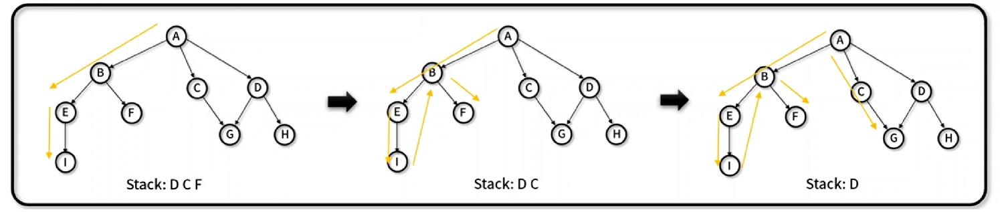
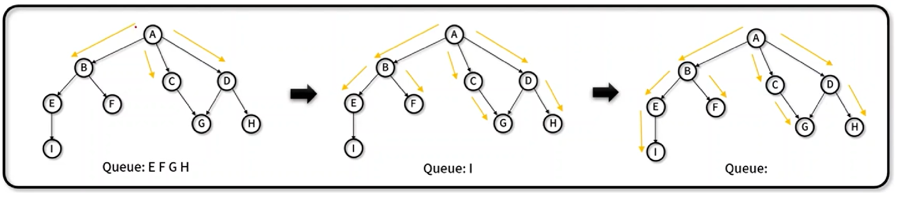

## 2. 비선형 자료구조

---

 

### 📌 DFS (Depth First Search)

---

- 트리나 그래프에서 `하나의 노드를 최대한 깊게 들어가면서` 해를 찾는 탐색 기법
- 특징

  1. `장점`

  - 인접한 후보 노드만 기억하면 되므로 적은 기억 공간이 소요된다.
  - 노드가 깊은 단계에 있을 경우 빠르게 정답을 산출할 수 있다.

  2. `단점`

  - 선택한 경로가 답이 아닐 경우 불필요한 탐색을 할 가능성이 있다.
  - 최단 경로를 구할 시 찾은 해가 정답이 아닐 경우가 발생한다.

- 탐색 방법 (인접한 노드 먼저 탐색을 )
  `왼쪽` A → B → E → I / → B → E → F
  `오른쪽` A → C → G → D → H / → D (x)
  `Stack` 앞으로 탐색해야하는 인접 노드의 모임
  

 

### 📌 BFS (Breadth First Search)

---

- 트리나 그래프 등에서 `인접한 노드를 우선 방문하면서` 넓게 움직이며 해를 찾는 탐색 기법- 특징

  1. `장점`

  - 최단 경로 탐색에서 구한 해가 정답임을 보장한다.

  2. `단점`

  - 경로가 매우 길어질 경우 탐색 범위가 증가하면서 DFS보다 많은 기억 공간이 필요하다.

- 탐색 방법 (인접한 노드 먼저 탐색을 )
  `왼쪽` A → B → E/F → I
  `오른쪽` A → C/D → G/H
  `Queue` 앞으로 탐색해야하는 인접 노드의 모임
  
