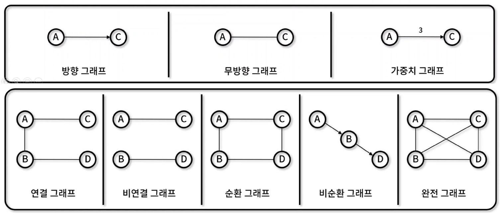
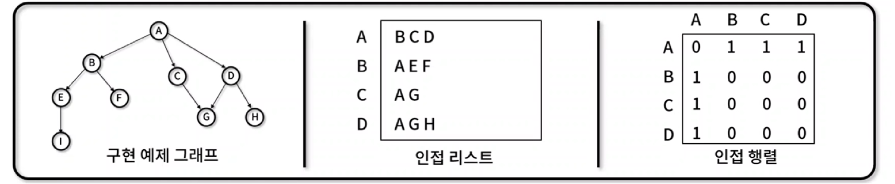

## 2. 비선형 자료구조

---

 

### 📌 그래프 (Graph)

---

- 정점과 간선으로 구성되어 `네트워크 구조`를 추상화한 비선형 자료 구조를 의미한다.
- **그래프의 특징**

  1. 정점과 간선의 집합
  2. 다양한 그래프 종류를 혼합하여 표현할 수 있음.

- **그래프 종류**

  1. `방향 그래프` 간선에 특정 방향이 존재하는 그래프 (A → B, A에서 B로만 이동 가능)
  2. `무방향 그래프` 간선에 특정 방향이 존재하지 않는 그래프 (A - B, 양방향 이동 가능)
  3. `가중치 그래프` 간선에 `비용이나 가중치`가 할당된 그래프
  4. `연결 그래프` 무방향 그래프에 있는 모든 정점쌍에 대해 항상 `경로가 존재하는` 그래프
  5. `비연결 그래프` 무방향 그래프에서 특정 정점쌍 사이에 `경로가 존재하지 않는` 그래프
  6. `순환 그래프` 단순 경로의 시작 정점과 종료 지점이 동일하여 `순환 지점`이 존재하는 그래프
  7. `비순환 그래프` 순환 지점이 존재하지 않는 그래프
  8. `완전 그래프` 그래프에 속해 있는 `모든 정점이 서로 연결`되어 있는 그래프
     구성 요소
     

- **그래프 종류**

  1. 인접 리스트: 정점에 연결된 다른 정점을 리스트로 표현한다.
  2. 인접 행렬: 정점에 연결된 다른 정점을 정점x정점 크기의 매트릭스로 표현한다.
     

- **활용 예시**

  1. 길찾기
  2. 지도, 네비게이션
  3. 네트워크 트래픽
  4. 게임 등등등
