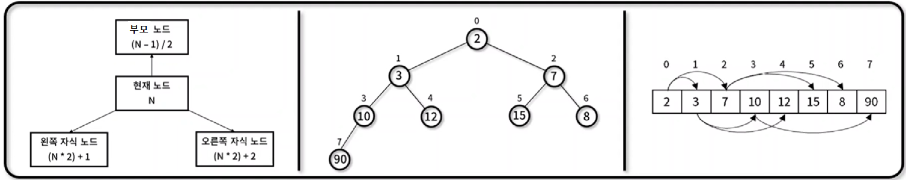
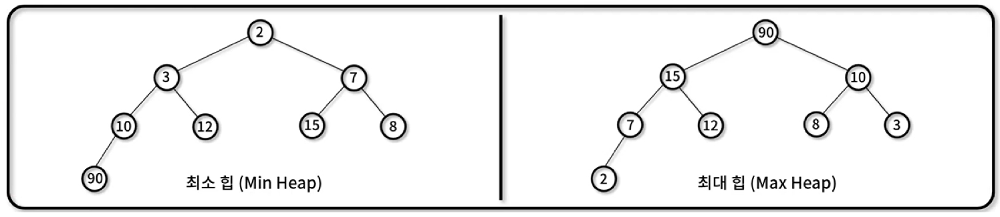

## 2. 비선형 자료구조

---

 

### 📌 힙 (Heap)

---

- 최댓값 혹은 최솟값을 빠르게 찾기 위해 `완전이진트리 형태로 연산을 수행`하는 자료구조를 말한다.

- 힙 대표 속성

  1. 정렬 : 각 노드의 값은 자식 노드가 가진 값보다 작거나 혹은 큰 순서대로 정렬된다.
  2. 형태 : 트리의 형태는 완전이진트리이다. (1차원 배열로 표현이 가능하다. 동일 레벨 → 형제 노드가 인접 배열로 변환)
  3. 표현방법

  - 현재노드 = N
  - 부모노드 = (N - 1) / 2
  - 왼쪽 자식 노드 = (N \* 2) + 1
  - 오른쪽 자식 노드 = (N \* 2) + 2
    

- 힙 종류
  1. 최소 힙 : `부모 노드`의 값이 자식 노드의 값보다 `작거나 같은` 완전 이진 트리
  2. 최대 힙 : `부모 노드`의 값이 자식 노드의 값보다 `크거나 같은` 완전 이진 트리
     
