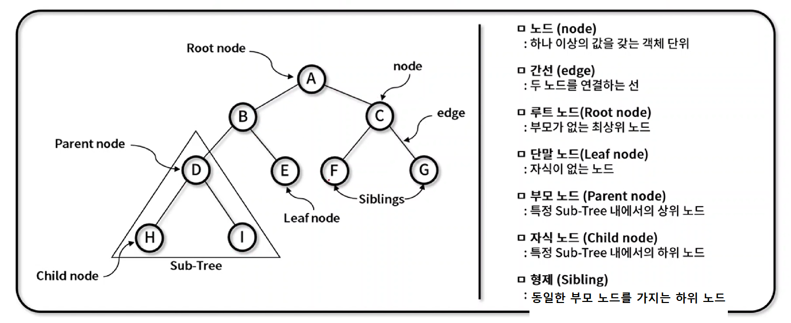
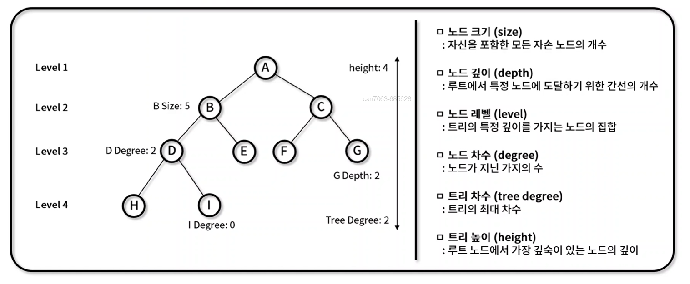

## 2. 비선형 자료구조

---

 

### 📌 트리 (Tree)

---

- 그래프의 일종으로 두 노브 사이의 `하나의 간선만 연결`되어 있는, `최소 연결`과 `계층 형태`의 비선형 자료 구조이다.
- 트리의 구조와 용어는 다음과 같다.

  - `노드 (node)`: 하나 이상의 값을 갖는 객체 단위
  - `간선 (edge)`: 두 노드를 연결하는 선
  - `루트 노드 (Root Node)`: 부모 노드가 없는 최상위 노드 (시작 위치)
  - `단말 노드 (Leaf Node)`: 자식 노드가 없는 노드
  - `부모 노드 (Parent Node)`: 특정 Sub-tree 내에서의 상위 노드
  - `자식 노드 (Child Node)`: 특정 Sub-tree 내에서의 하위 노드
  - `형제 (Sibling)`: 동일한 부모 노드를 가지는 자식 노드
  - 구성 사진
    

- **주요 특징**

  - 최소 연결 트리
  - 계층 모델
  - 방향 비순환 그래프의 한 종류

- **종류**

  - 이진 트리
  - 이진 탐색 트리
  - AVL 트리
  - 힙 (heap)

- **특성**
  - `노드 크기(size)`: 자신을 포함한 모든 자손 노드의 개수
  - `노드 깊이(depth)`: 루트에서 특정 노드에 도달하기 위한 간선의 개수
  - `노드 레벨(level)`: 트리의 특정 깊이를 가지는 노드의 집합
  - `노드 차수(degree)`: 노드가 지닌 가지의 수
  - `트리 차수(tree degree)`: 트리의 최대 차수
  - `트리 높이(height)`: 루트 노드에서 가장 깊숙히 있는 노드의 깊이
  - 구성 사진
    

 

### 📌 이진 트리 (Binary Tree)

---

- 각각의 노드가 최대 두개의 자식 노드를 가지는 트리 자료 구조이다.
- 활용 방식 예
  1. 검색과 정렬: 이진 탐색 트리와 이진 힙 구현에 활용
  2. 허프만 코딩: 연관 분기 구조를 위한 데이터 표현에 활용

> 포화 이진 트리 (Perfect Binary Tree)

- 모든 레벨의 노드가 가득 채워져 있는 트리를 의미한다.
- Leaf 노드 (단말 노드)를 제외한 모든 자식은 2개의 노드를 보유한다.
- 노드의 개수는 `2의 h(트리 높이) 제곱의 - 1` 을 한 값이다.

> 완전 이진 트리 (Complete Binary Tree)

- 마지막 레벨 전까지 노드가 가득 채워져있고, 마지막 레벨은 왼쪽부터 순차적으로 채워져 있는 트리를 의미한다.
  (일부의 단말 노드가 없는 상태)
- 배열을 사용해 효울적인 표현이 가능하다.
- 노드의 개수는 포화 이진 트리의 값 `미만의 값`이다.

> 정 이진 트리 (Full Binary Tree)

- 모든 노드가 0개 또는 2개의 자식 노드만 갖는 트리를 의미한다.
  (단말 노드가 없거나 포화 이진 트리와 같은 단말 노드의 수를 가짐.)
- proper 또는 plane 이진 트리라고도 불린다.
- 노드의 개수는 포화 이진 트리의 값 `이하의 값`이다.

> 편향 이진 트리 (Skewed Binary Tree)

- 왼쪽 혹은 오른쪽으로 편향되게 치우쳐 있는 트리를 의미한다.
- 각각의 높이에 하나의 노드만 존재한다.
- 노드의 개수는 `h(트리 높이)`이다.

> 균형 이진 트리 (Balanced Binary Tree)

- 삽입/삭제가 이루어질 때, 왼쪽 서브 트리와 오른쪽 서브 트리의 높이 차를 `1 이하`로 맞추는 이진 탐색 트리이다.
- 서브 트리 높이 차이가 `항상 1이하로 유지`된다.
- 균형 트리의 종류 `AVL` `Red-black` `B` `B+` `B*`
