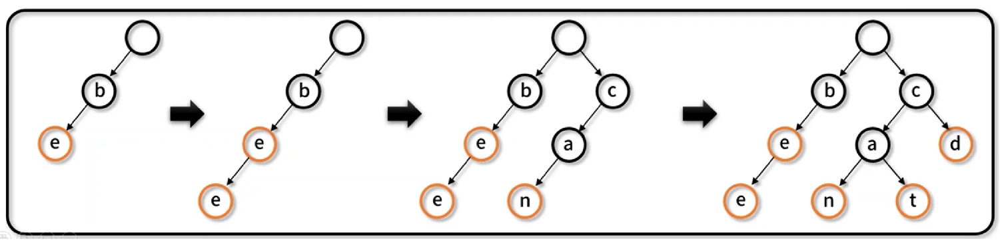

## 2. 비선형 자료구조

---

 

### 📌 트라이 (Trie)

---

- 탐색 트리의 일종으로, `문자열`이나 `연관 배열`을 저장하는 데 사용되는 트리 자료 구조이다.

- 트라이 특징

  1. `문자열 검색`에 특화된 자료구조이다.
  2. 문자열 길이가 M일 경우 O(M)의 시간 복잡도로 검색이 가능하다.
  3. 동일한 문자열이 있다면 순서를 보장한 상태에서 재활용이 가능하다.
     아래 사진 참고.

     be 추가 (마지막 노드 `e`)
     → bee 추가 / e만 추가하면 됨. (마지막 노드 `e`)

     can 추가 / (마지막 노드 `n` )
     → cat 추가 / a와 t만 추가하면 됨. (마지막 노드 `t`)
     → cd 추가 / d만 추가하면 됨. (마지막 노드 `d`)
     
