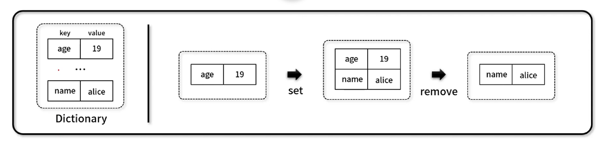

## 1. 선형 자료구조

---

 

### 📌 딕셔너리 (Dictionary)

---

- 보통 파이썬에서 실제 지원하고 있는 자료형 중 하나이다.
- `key-value` 형태로 다양한 자료형 개체(entity)를 저장하는 자료구조이다.
- 구성 요소 ( 다수의 `key: value`로 이루어져 있는 배열)
  - key
  - value
  - 구성 사진
    
     
