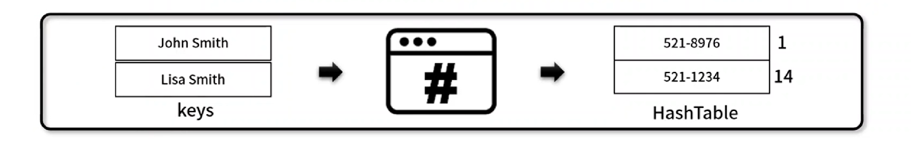
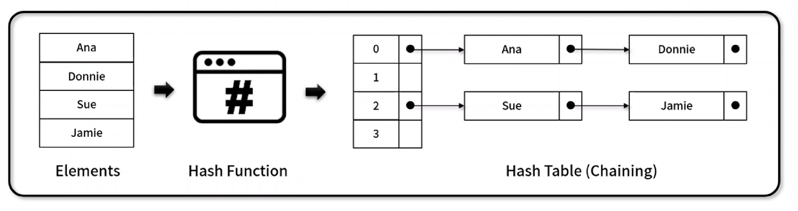

## 1. 선형 자료구조

---

 

### 📌 해시테이블 (Hash Table)

---

**해시함수란? (Hash function)**

- 임의의 길이의 데이터를 고정된 길이의 데이터로 매핑하는 함수를 말한다.
- 해시 함수의 특성
  1. 압축성: 다양한 가변 길이의 입력에 대해 `고정된 크기`의 결과값을 반환하는 성질
  2. 효율성: 어떠한 입력 값에 대해서도 많은 자원과 시간이 소요되지 않고 이미 `지정된 값`으로 처리되는 성질
  3. 저항성: 결과값을 바탕으로 입력 값을 `되찾는 것이 불가능한` 성질

**해시 테이블 (Hash Table)**

- 해시 함수를 사용하여 평균 O(1) 시간 복잡도로 특정 값을 신속하게 찾는 자료구조
- 충돌 (collision) 해결 방법

  > `충돌`이란, 어떤 입력 데이터들이 동일한 해시값을 갖는 경우, 데이터가 저장되지 않거나 데이터가 이미 저장되어 있다고 해석 오류를 내는 경우를 말한다.

  - 해시 함수 변경: 더 큰 숫자의 `공간`과 `modular 산술 값`을 이용해 충돌을 최소화한다.
  - 자료 구조 확장: `Open Addressing Method`(선형 조사법, 이중해시), `Close Addressing Method`(체이닝 - 연결리스트로 다른 배열과 병합하는 방법)

- 구성 요소
  - key : 변환되기 이전의 값
  - Hash_table (value) : 변환된 이후 index에 해당하는 값
  - 구성사진
    

 

### 📌 체이닝 해시테이블 (Chaining Hash Table)

---

- 별도의 자료구조인 연결리스트를 병합 사용하여 Hash 충돌을 해결한 해시테이블 기반 자료구조
- 구성 요소
  - key (element)
  - index 배정 (hash 함수 기반)
  - 해당 index의 `next` 값은 `key(element)`를 가리키며, 동일한 `key(element)`를 다시 `next` 값으로 연결할 수 있다.
    
