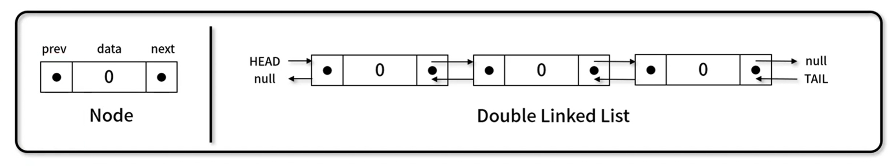

## 1. 선형 자료구조

---

 

### **3. 연결리스트**

- 각 노드가 데이터와 포인터를 가지며, 한 줄로 연결되어 있는 방식으로 데이터를 저장하는 자료 구조
- 구현 메서드
  - 노드 개수 / 비어 있는지 확인 / 노드 출력 : LinkedList.size(), LinkedList.isEmpty(), LinkedList.printNode()
  - 노드 추가: LinkedList.append(), LinkedList.insert()
  - 노드 삭제: LinkedList.remove(), LinkedList.removeAt()
  - 데이터 위치 확인: LinkedList.indexOf();
- 구성 요소
  
  - NODE
    - data : 값을 갖고 있는 element
    - next : 또 다른 node를 가리킬 수 있는 pointer
  - LinkedList (여러 개의 노드로 구성)
    - head : 첫 지점. (첫번째 노드를 가리키는 pointer)
    - null : 끝 지점. (마지막 next 값에 null이 저장)
- 새로운 elements를 삽입하고 삭제하는데 용이하며 restructing이 덜 복잡하다.
- 반면 array보다 많은 메모리를 사용하고 특정 element 검색 시 비효율적이다.

- 예시 ...
  `음악 플레이 리스트, 전철 노선도, ctrl+z or ctrl+y,` 등...

 
 

### **4. 이중연결리스트**

- 각 노드가 데이터와 포인트를 가지며, 두 줄로 연결되어 있는 방식으로 데이터를 저장하는 자료구조
- 구현 메서드
  - 노드 개수 / 비어있는지 확인 : DoubleLinkedList.size(), DoubleLinkedList.isEmpty()
  - 순차 출력 / 역 출력: DoubleLinkedList.printNode(), DoubleLinkedList.printNodeInverse()
  - 노드 추가: DoubleLinkedList.append(), DoubleLinkedList.insert()
  - 노드 삭제: DoubleLinkedList.remove(), DoubleLinkedList.removeAt()
  - 데이터 위치 확인: DoubleLinkedList.indexOf()
- 구성 요소
  

  - Node
    - prev ... 기존 연결리스트와의 차이점 ... 이전 포인트를 가리킨다.
    - data
    - next
  - doubleLinkedList

    - head
    - null
    - Tail ... 기존 연결리스트와의 차이점 ... 리스트 마지막 부분에서 탐색이 가능하다.

  - 관리해야되는 부분이 prev와 next이기 때문에 구현시 신경을 써줘야 한다.

 
 

### **5. 원형연결리스트**

- 각 노드가 데이터와 포인터를 가지며, 원형 형태로 연결되어 있는 방식으로 데이터를 저장하는 자료 구조.
- 구현 메서드 (method)

  - 노드 개수 / 비어있는지 확인 : CircularLinkedList.size(), CirculareLinkedList.isEmpty()
  - 노드 추가: CirculareLinkedList.append(), CirculareLinkedList.insert()
  - 노드 삭제: CirculareLinkedList.remove(), CirculareLinkedList.removeAt()
  - 데이터 위치 확인 / 노드 출력: CirculareLinkedList.indexOf(), CircularLinkedList.printNode()

- 구성요소
  
  - NODE
    - data : 값을 갖고 있는 element
    - next : 또 다른 node를 가리킬 수 있는 pointer
  - CiurcularLinkedList (여러 개의 노드로 구성)
    - head : 첫 지점. (첫번째 노드를 가리키는 pointer)
    - 마지막 부분: head ... 일방 연결리스트와 동일하지만, 끝부분이 다시 첫부분을 가리킨다.
