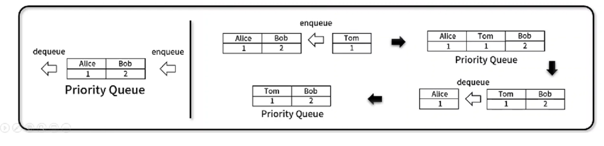
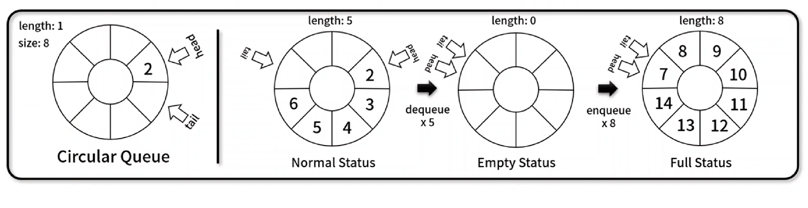
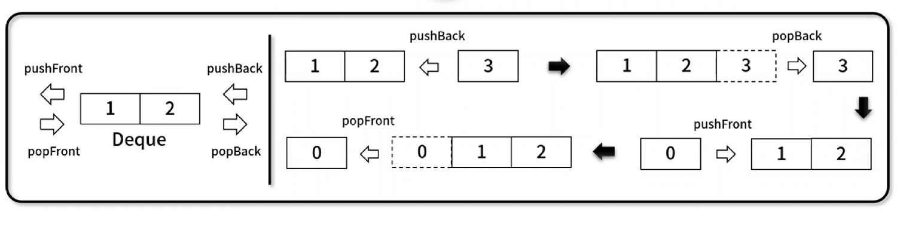

## 1. 선형 자료구조

---

 

### **6. 큐**

---

- 먼저 넣은 데이터가 먼저 나오는 `FILO(First In Last Out)` 기반의 선형 자료 구조이다.
- 구현 메서드
  - ..데이터 전체 획득 / 비어 있는지 확인: Queuek.getBuffer(), Queuek.isEmpty()
  - ..추가 / 삭제 : Queue.enqueue(), Queue.dequeue()
  - ..첫번째 데이터 / 사이즈 / 전체 삭제: Queuek.front(), Queuek.size(), Queue.clear()
- 구성 요소
  
  - stack과 동일한 배열 기반의 데이터
  - 데이터 삽입 뒤쪽에서, 데이터 반환은 앞쪽에서 이루어짐.
- 사례
  - 이메일, 메신저 등 먼저 보낸 매시지의 처리 순서
  - 쇼핑몰 주문, 콜센터 대기 등 순서가 필요한 경우
     

### 📌 우선순위 큐 (priority Queue)

---

- 우선순위를 고려하여 먼저 넣은 데이터가 먼저 나오는 `FIFO(First in Fisrt Out)` 기반의 선형 자료 구조이다.
- 우선 순위 정렬 방식은 `배열 기반` `연결리스트 기반` `힙` 기반 등이 존재한다.
- 구성 요소
  

 

### 📌 원형 큐 (Circular Queue)

---

- 우선순위를 고려하여 먼저 넣은 데이터가 먼저 나오는 `FIFO(First in Fisrt Out)` 기반의 선형 자료 구조이다.
- 구성 요소
  - `head` 현재 위치의 데이터
  - `tail` 마지막 위치의 데이터
  - 구성 사진
    

 

### 📌 데크 (Deque)

---

- Double Ended Queue의 약자이다.
- 삽입과 삭제가 양쪽 끝에서 모두 발생할 수 있는 선형 자료 구조이다.
- 구성 메서드 중...
  - push_front
  - pop_front
  - push_back
  - pop_back
  - 구성 사진
    
