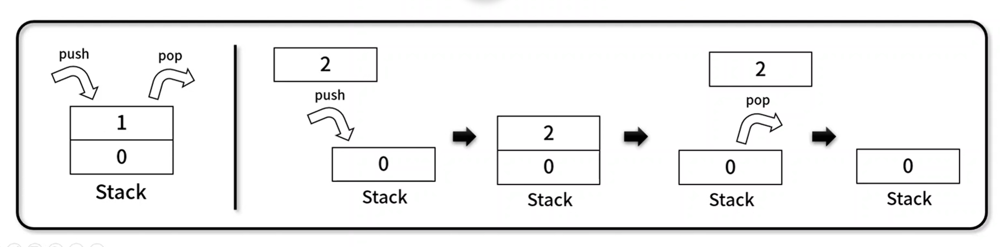

## 1. 선형 자료구조

---

 

### **5. 스택**

---

- 나중에 넣은 데이터가 먼저 나오는 `LIFO(Last In First Out)` 기반의 선형 자료 구조이다.
- 구현 메서드
  - ..데이터 전체 획득 / 비어 있는지 확인: Stack.getBuffer(), stack.isEmpty()
  - ..추가 / 삭제 / 마지막 데이터 조회 / 크기 확인: Stack.push(), Stack.pop(), Stack.peak(), Stack.size()
  - ..데이터 위치 / 존재 여부 확인: Stack.indexOf(), Stack.includes()
- 구성 요소
  
  - push를 통해 삽입된 데이터는 이전 값 윗부분에 쌓인다.
  - pop을 통해 가장 나중에 삽입된 데이터가 반환된다.
- 사례
  - ctrl + z
  - 웹 브라우저 페이지 뒤로 가기
